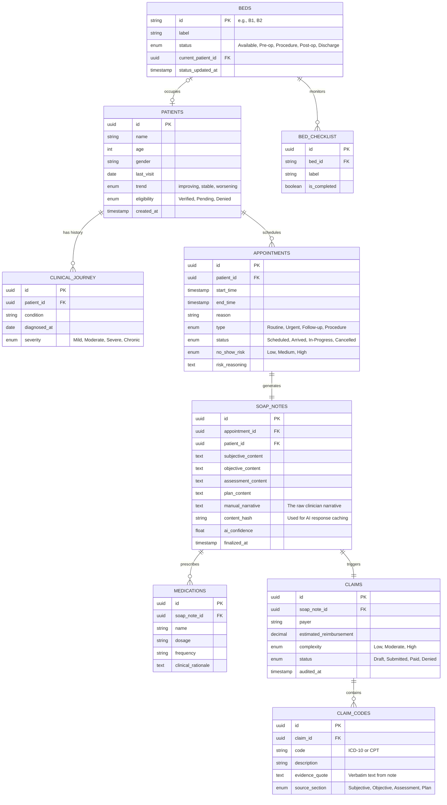

# FlowMD: PostgreSQL Schema & Entity Relationship Diagram (ERD)

This document defines the production-ready data model for FlowMD. It is designed for PostgreSQL to handle complex clinical relationships, AI-powered billing audits, and longitudinal patient tracking.

## 1. Core Schema Overview

## 2. Intelligence Logic Details

### Content-Based Caching (`SOAP_NOTES.content_hash`)
The `content_hash` column stores a hash of the `manual_narrative` and `assessment_content`. When a request is made to generate a **Revenue Audit** or a **Patient Handout**, the backend checks if a result already exists for that specific hash. This minimizes LLM costs and latency if a doctor toggles tabs without changing the note.

### Verbatim Justification (`CLAIM_CODES.evidence_quote`)
To survive insurance audits, the `evidence_quote` stores the exact substring returned by the Gemini AI that justified the code. This prevents the "Black Box" problem in AI billing.

### Longitudinal Joins
By separating `CLINICAL_JOURNEY` from `SOAP_NOTES`, the AI engine can perform a RAG (Retrieval-Augmented Generation) query across the history table to provide the "Clinical Twins" and "Safety Alerts" features seen in the UI.

## 3. Recommended Node.js Stack
- **ORM**: Prisma (for type-safe clinical schemas).
- **Database**: PostgreSQL (with JSONB support for unstructured ROS/PE findings).
- **Migrations**: Automated through Prisma Migrate to handle evolving clinical fields.
